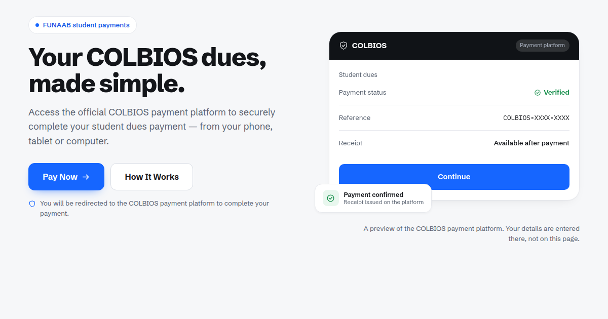

# COLBIOS — FUNAAB student payments landing page

The public page students see **before** entering the COLBIOS payment platform.
Built with **React + Vite**.



---

## What this is, and what it is not

| This website | The COLBIOS payment platform |
|---|---|
| Explains what COLBIOS is | Student identification |
| Shows how paying works | Payment processing |
| Answers common questions | Transaction confirmation |
| Sends students to the platform | Receipts |

**No payment information is collected here.** There is no form, input or field
of any kind in this app — matriculation numbers, card details, bank details and
amounts all belong to the separate platform. Every `Pay Now` is a link that
hands the student off.

---

## Quick start

```bash
npm install
npm run dev        # http://localhost:5173
npm run build      # -> dist/
npm run preview    # serve the production build
```

---

## Configure it

There are two ways to set the payment destination. **Build-time environment
variables win; the runtime file is the fallback.**

### 1. Runtime file — `public/colbios-config.js`

Served unbundled from `dist/`, so you can re-point a **deployed** build by
editing one file, with no rebuild.

```js
window.__COLBIOS_CONFIG__ = {
  PAYMENT_PLATFORM_URL: '',        // REQUIRED — where Pay Now sends students
  OPEN_IN_NEW_TAB: false,
  REDIRECT_DELAY_MS: 650,
  INSTITUTION_NAME: 'Federal University of Agriculture, Abeokuta',
  INSTITUTION_SHORT: 'FUNAAB',
  INSTITUTION_RELATIONSHIP: '',
  SUPPORT_EMAIL: '', SUPPORT_PHONE: '', SUPPORT_HOURS: '',
  PRIVACY_URL: '', TERMS_URL: '', SITE_URL: '',
  STATS: [],
  PARTNER_LOGOS: []
};
```

### 2. Environment variables (Vercel → Settings → Environment Variables)

`VITE_PAYMENT_PLATFORM_URL`, `VITE_SITE_URL`, `VITE_SUPPORT_EMAIL`,
`VITE_SUPPORT_PHONE`, `VITE_INSTITUTION_RELATIONSHIP`, `VITE_PRIVACY_URL`,
`VITE_TERMS_URL`.

`src/config.js` merges both and is the **only** place the destination is
resolved. All six Pay Now buttons — header, hero, the platform preview card,
the mid-page card, the closing card and the footer — read from it. Nothing is
hardcoded.

**Until it is set**, Pay Now does not fail silently: it stays focusable, renders
muted rather than blue, and pressing it explains that no destination is
configured. An unconfigured deploy is obvious instead of looking broken to a
student. Only `http:`/`https:` URLs are accepted, so a malformed or unsafe value
is rejected rather than becoming a live link.

### The two data-driven sections

`STATS` and `PARTNER_LOGOS` are **scaffolding, empty by default**. The sections
do not render at all while the arrays are empty, so nothing invented can ship by
accident. Fill them with real figures and logos you are permitted to display:

```js
STATS: [
  { value: '12,480', label: 'Payments completed' },
  { value: '4',      label: 'Colleges served', note: 'optional third line' }
],
PARTNER_LOGOS: [
  { name: 'Example Bank', src: '/logos/example-bank.svg' }   // files in public/logos/
]
```

Up to four stats sit on one row; logo images live in `public/`.

### Before launch

Replace `https://colbios.example.com/` in the canonical, `og:url` and
`og:image` tags in `index.html`. `example.com` is the reserved documentation
domain, so it is unmistakably a placeholder. Setting `SITE_URL` also updates
canonical and `og:url` at runtime, but crawlers that do not run JavaScript read
the markup — change both.

`INSTITUTION_RELATIONSHIP` is empty by default and **should stay empty** unless
the relationship with the university is established and you are authorised to
state it. The page never claims to be owned, endorsed or accredited by FUNAAB.

---

## Deploying

`vercel.json` pins the framework, build command and output directory, so the
deploy does not depend on the Vercel project's detected preset:

```json
{ "framework": "vite", "buildCommand": "npm run build", "outputDirectory": "dist" }
```

Any static host works — build and serve `dist/`.

> **Note:** if preview URLs redirect to a Vercel login, that is **Deployment
> Protection** on the project, not a problem with the build. Check it is off for
> production before launch, or students will hit a login screen.

---

## Design

The visual direction follows the supplied reference: a near-white page, white
rounded cards, generous whitespace, short heading left / body right, and UI
cards overlapping one another.

| Token | Value | Role |
|---|---|---|
| `--page` | `#F6F7F9` | Page background |
| `--card` | `#FFFFFF` | Cards |
| `--blue` | `#1666FF` | Pay Now, fills, accents |
| `--blue-deep` | `#0F55E6` | Hover, and blue used as text |
| `--dark` | `#101317` | Preview header, closing card, footer |
| `--ink` | `#14161A` | Body text |
| `--ok` | `#0E8B45` | Confirmation state |

`#1666FF` is sampled from the reference. It scores **4.80:1** against white, so
it is fine as a button fill, but only **4.47:1** against the page — which fails
AA — so `#0F55E6` (5.66:1) is used wherever blue becomes text. Status is never
communicated by colour alone: "Verified", "This is where you pay" and "No
payment details are entered here" each carry an icon and words.

Type is **Schibsted Grotesk** (one variable file, 400–900), with **IBM Plex
Mono** only for the reference-number figure in the preview card.

The hero visual is a still preview of the payment platform, captioned so
students know what it is, and wrapped in the same Pay Now link so pressing its
"Continue" button does what it appears to do.

---

## Content policy

Nothing on this page is invented. No customer logos, testimonials, transaction
volumes, student counts, uptime figures, live counters or security
certifications. The only numbers in the visible text are the step markers
`01`–`03` and the copyright year. The preview card's reference is masked
(`COLBIOS-XXXX-XXXX`) so it reads as a template.

If you add content, keep to this: describe what COLBIOS does, not how many
people use it.

---

## Accessibility and performance

- **No continuously running animation.** Motion is one-time entrance reveals and
  press feedback; the redirect progress bar plays once. A test fails the suite
  if any CSS rule declares an infinite animation.
- Skip link, semantic landmarks, visible focus rings, `aria-expanded` on the
  accordion and mobile menu, collapsed FAQ panels taken out of the accessibility
  tree via `visibility` once their transition finishes, 54px primary tap
  targets, and `prefers-reduced-motion` respected.
- Mobile-first ordering: header → headline → explanation → **Pay Now** → trust
  indicators → how it works. The header Pay Now stays visible rather than
  hiding behind the hamburger.
- Fonts self-hosted; no third-party requests at runtime.

**Bundle:** ~53 KB gzipped JS, ~5 KB gzipped CSS. Note that React makes this
larger than the previous vanilla build (~9 KB JS) and means the page is
client-rendered: the body content needs JavaScript. The SEO-critical parts —
title, description, canonical, Open Graph, Twitter card and JSON-LD — are static
in `index.html`, so social previews and crawlers still get them. If you later
want the body in the HTML too, add a prerender step to the build.

---

## Project layout

```
index.html                  Vite entry + all SEO metadata
vercel.json                 Pins framework/build/output for deploys
public/
  colbios-config.js         >>> edit this to deploy <<<
  fonts/ favicon.svg og-image.png
src/
  main.jsx  App.jsx         Entry and page composition
  config.js                 Merges env + runtime config; URL validation
  payments.jsx              PaymentProvider, PayButton, handoff overlay
  components/               Header Hero LogoStrip Benefits Stats
                            HowItWorks CtaCard About Faq Footer
                            Reveal Icons
  styles/                   tokens + components, and @font-face
```

Copy lives inside the components as plain JSX text — there is no CMS or
templating. The FAQ is an array in `src/components/Faq.jsx`; add an entry there
and mirror it in the `FAQPage` JSON-LD if you add one to `index.html`.
