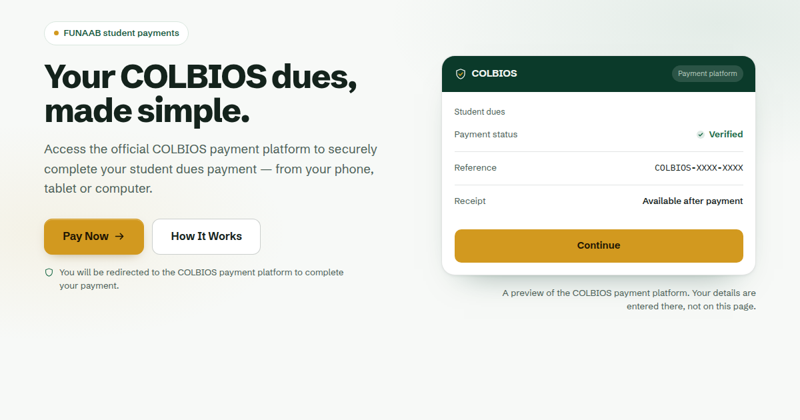

# COLBIOS — FUNAAB student payments landing page

The public page students see **before** entering the COLBIOS payment platform.
Static HTML, CSS and JavaScript — no build step, no framework, no runtime
dependencies.



---

## What this is, and what it is not

| This website | The COLBIOS payment platform |
|---|---|
| Explains what COLBIOS is | Student identification |
| Shows how paying works | Payment processing |
| Answers common questions | Transaction confirmation |
| Sends students to the platform | Receipts |

**No payment information is collected here.** There is no `<form>`, no `<input>`
and no field of any kind in this page — matriculation numbers, card details,
bank details and amounts all belong to the separate platform. Every `Pay Now`
button is a link that hands the student off.

---

## Configure it before you deploy

Everything you need to change lives in **one file**: `assets/js/config.js`.

```js
window.__COLBIOS_CONFIG__ = {
  PAYMENT_PLATFORM_URL: '',        // REQUIRED — where Pay Now sends students
  OPEN_IN_NEW_TAB: false,
  REDIRECT_DELAY_MS: 650,
  INSTITUTION_NAME: 'Federal University of Agriculture, Abeokuta',
  INSTITUTION_SHORT: 'FUNAAB',
  INSTITUTION_RELATIONSHIP: '',    // see "Institutional wording" below
  SUPPORT_EMAIL: '', SUPPORT_PHONE: '', SUPPORT_HOURS: '',
  PRIVACY_URL: '', TERMS_URL: '',
  SITE_URL: ''
};
```

`PAYMENT_PLATFORM_URL` is the **only** place the payment destination is written.
All six Pay Now buttons — header, hero, the platform preview card, the mid-page
band, the closing band and the footer — read from it. Nothing is hardcoded.

**Until it is set**, Pay Now does not fail silently: it stays focusable, appears
muted rather than gold, and pressing it explains that no destination has been
configured. That is deliberate, so an unconfigured deploy is obvious instead of
looking broken to a student.

Only `http:` and `https:` URLs are accepted. A malformed or unsafe value is
rejected rather than becoming a live link.

### Also replace before launch

`https://colbios.example.com/` appears in the canonical, `og:url` and
`og:image` tags in `index.html`. `example.com` is the reserved documentation
domain, so it is obviously a placeholder — swap it for your real domain.
Setting `SITE_URL` in the config also updates canonical and `og:url` at
runtime, but crawlers that do not run JavaScript read the markup, so change
both.

### Institutional wording

`INSTITUTION_RELATIONSHIP` is **empty by default and should stay empty** unless
the relationship between COLBIOS and the university is established and you are
authorised to state it. The page never claims to be owned, endorsed, accredited
or operated by FUNAAB. Whatever you put in that field is printed verbatim in
the footer.

### Support details

`SUPPORT_EMAIL`, `SUPPORT_PHONE` and `SUPPORT_HOURS` are empty by default. When
they are empty the footer and the FAQ tell students to use the support channel
on the payment platform, rather than showing a contact that does not exist. Set
them and they appear in both places automatically.

`PRIVACY_URL` and `TERMS_URL` work the same way: unset, the footer renders those
labels as plain non-focusable text rather than as links to pages that are not
there.

---

## Run and deploy

```bash
python3 -m http.server 8000     # or: npx serve .
```

Upload the folder as-is. Netlify, Vercel, GitHub Pages, Cloudflare Pages and S3
all work with no configuration. The only build-time decision is editing
`config.js`.

---

## The design

**Institutional, not fintech-generic.** Deep forest green carries the structure
— header mark, the two call-to-action bands, the footer, the preview card's
header. A single gold accent (`#D2991F`) is reserved almost entirely for one
thing: the Pay Now button. Because nothing else on the page is gold, the eye
lands on the action every time.

| Token | Value | Role |
|---|---|---|
| `--green-900` | `#0B3A2A` | CTA bands, footer, preview header |
| `--green-600` | `#1B6B48` | Confirmation states, icons |
| `--green-50` | `#EDF3EE` | Alternating section tint |
| `--paper` | `#F7F9F7` | Page background |
| `--ink` | `#14231C` | Body text |
| `--accent` | `#D2991F` | Pay Now, step markers, the mark's check |

Type is **Schibsted Grotesk** throughout (one variable file, 400–900), with
**IBM Plex Mono** used only for the reference-number style figure in the preview
card. Status is never communicated by colour alone — "Verified", "This is where
you pay" and "No payment details are entered here" all carry an icon and words.

**The hero visual** is a still preview of the payment platform, captioned so
students know what they are looking at. It is wrapped in the same Pay Now link,
so pressing the "Continue" button it shows does what it appears to do rather
than nothing.

---

## Content policy

Nothing on this page is invented. There are no customer logos, no testimonials,
no transaction volumes, no student counts, no uptime figures, no live counters
and no security certifications. The only numbers in the visible text are the
step markers `01`–`03` and the copyright year. The reference number in the
preview card is masked (`COLBIOS-XXXX-XXXX`) so it reads as a template rather
than a real transaction.

If you add content, keep to this: describe what COLBIOS does, not how many
people use it.

---

## Performance and accessibility

- **~120 KB total**, around 45 KB over the wire gzipped. Zero third-party
  requests — fonts are self-hosted (82 KB across three files, only the two
  latin faces preloaded).
- **No continuously running animation.** Motion is limited to one-time entrance
  reveals and hover/press feedback. The redirect's progress bar plays once. This
  is verified by a test that fails if any CSS rule declares an infinite
  animation.
- **Works without JavaScript**: reveals are scoped to a `.js` class that only
  exists when a script runs, so a scriptless visitor gets the whole page.
- Skip link, semantic landmarks, visible focus rings, `aria-expanded` on the
  accordion and mobile menu, collapsed FAQ panels removed from the
  accessibility tree, 54px primary tap targets, and `prefers-reduced-motion`
  respected.
- Mobile-first ordering: header → headline → explanation → **Pay Now** → trust
  indicators → how it works. The primary action is never below a decorative
  block, and the header Pay Now stays visible rather than hiding behind the
  hamburger.

Verified in headless Chromium by 33 automated checks covering both the
configured and unconfigured redirect paths, the interstitial, FAQ semantics,
keyboard order, mobile layout, reduced motion, the no-JS path, and no
horizontal overflow from 320 px to 1920 px.

---

## Files

```
index.html               All markup, inline SVG and structured data
assets/js/config.js      >>> the only file you need to edit to deploy <<<
assets/js/main.js        Redirect handoff, header, reveals, FAQ
assets/css/styles.css    Tokens, then components in page order
assets/css/fonts.css     @font-face declarations
assets/fonts/            Self-hosted woff2
assets/img/favicon.svg   The COLBIOS shield mark
assets/img/og-image.png  Social card, 1200×630
```

---

## Editing content

All copy is plain text in `index.html` — there is no templating. The FAQ is a
list of `.faq__item` blocks; to add one, copy a block and give the button and
panel a new matching `id`/`aria-controls` pair, then add the same question and
answer to the `FAQPage` JSON-LD in `<head>` so the structured data stays true to
the page.

Elements marked `data-institution-short`, `data-institution-name`,
`data-institution-relationship`, `data-support-block` and `data-support-answer`
are filled from the config at runtime; edit the config rather than the markup
for those.
